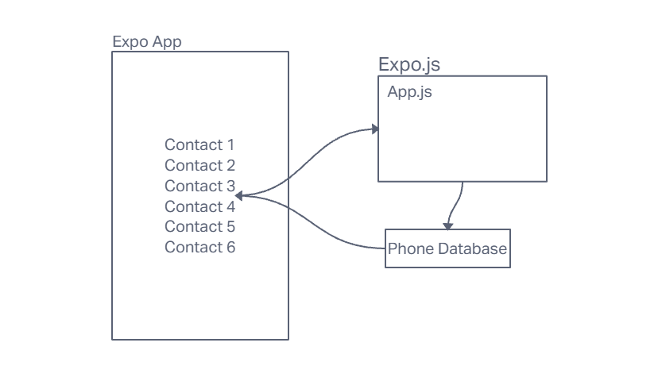

# LAB - Class 43

## Project: React Native/Expo

### Author: Student/Group Name

### Problem Domain  

This reop is our firt time making a mobile app. This lab is built to introduce us to React Redux and Expo

### Links and Resources

- [front-end application](http://xyz.com) (when applicable)

### Collaborators

### Setup

#### `.env` requirements (where applicable)

for now I have none and do not require one

#### How to initialize/run your application (where applicable)

- Clone the Repo onto your local device
- npm i
- Type npx epo
- Scan the QR code onto your computer

#### How to use your library (where applicable)

#### Features / Routes

- Check boxes to reveal contacts
- Ability to call with the press of a button
- Haptic Touch
- (Contact Functionality might not work if you have a contact with no name)

#### Tests

#### UML

